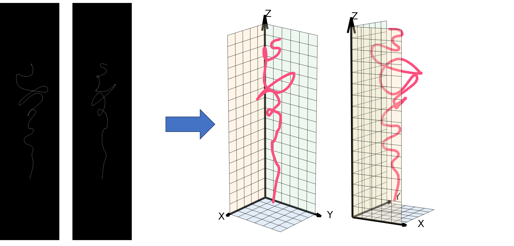

# ACCURATE: Arbitrary-shaped Continuum Reconstruction Under Robust Adaptive Two-view Estimation

Official implementation of:

**ACCURATE: Arbitrary-shaped Continuum Reconstruction Under Robust Adaptive Two-view Estimation**

---

## 📌 Overview


ACCURATE is a geometry-aware framework for accurate **3D reconstruction of arbitrary-shaped long slender continuum structures** (e.g., guidewires, catheters, and continuum robots) from **biplanar images**.

Unlike end-to-end learning-based reconstruction methods, ACCURATE explicitly integrates:

* Topology-aware Segmentation Network
* Geometry-consistent Curve Topology Traversal
* Epipolar-constrained Dynamic Programming

to enforce strict multi-view geometric consistency.

The pipeline consists of three sequential stages:

1. **Topology-aware Segmentation Network (TSN)**
   Extracts one-pixel-wide centerlines from X-ray images.

2. **Geometry-consistent Curve Topology Traversal (GCTT)**
   Converts unordered skeleton pixels into topology-ordered curves.

3. **Epipolar-constrained Dynamic Programming (ECDP)**
   Establishes globally optimal correspondences and reconstructs 3D shape via triangulation.

The method achieves **sub-millimeter reconstruction accuracy** on both simulated and real phantom datasets .



---

## 📂 Repository Structure

```
RECONSTRUCTION/
│
├── ACCURATE_dataset/        # dataset (simulation + phantom)
│
├── core/                    # reconstruction algorithms
│   ├── main.py              # full reconstruction pipeline
│   ├── main_point.py        # reconstruction using ordered points
│   ├── cur_dp.py            # GCTT + ECDP
│   └── cur_dp_simple.py     # simplified GCTT + ECDP
│
├── utils/                   # utilities
│   ├── calibration.py       # camera geometry calibration
│   ├── model.py             # segmentation network definition for demo
│   ├── seg_train.py         # segment network training
│   ├── seg_test.py          # segmentation inference
│   ├── seg_3d.py            # 3D reconstruction result process for benchmark methods
│   ├── process_figures.py   
│   ├── draw_fig.py          # visualization for paper
│   └── test.py              # reproducing paper results
│
├── experiment/              # experiment results
├── original_data/           # raw data
└── .gitignore
```

---


## 🚀 Usage

### 1️⃣ Segmentation (TSN)

Train segmentation network (For this demo we use simple Unet):

```bash
python utils/seg_train.py
```

Inference:

```bash
python utils/seg_test.py
```

Output:

```
centerline masks
```

---

### 2️⃣ Reconstruction Pipeline

Quick run reconstruction based on GT masks:

```bash
python core/main.py
```

Pipeline:

```
Masks
  ↓
Topology Traversal (GCTT)
  ↓
Dynamic Programming Matching (ECDP)
  ↓
Triangulation
  ↓
3D reconstruction
```

---

### 3️⃣ Reconstruction from Ordered Points

```bash
python core/main_point.py
```

This bypasses segmentation and traversal.

---

## 📈 Evaluation Metrics

We follow standard reconstruction metrics:

* **Accuracy (Acc.)**
* **Completeness (Comp.)**
* **Chamfer Distance (Overall)**
* **Maximum Error (Max Err.)**

---

## 📷 Visualization

Generate reconstruction visualization:

```bash
python utils/draw_fig.py
```

Outputs:

* GT 3D curves
* reconstructed 3D curves

---

## 📄 License

This project is released for academic research purposes only.